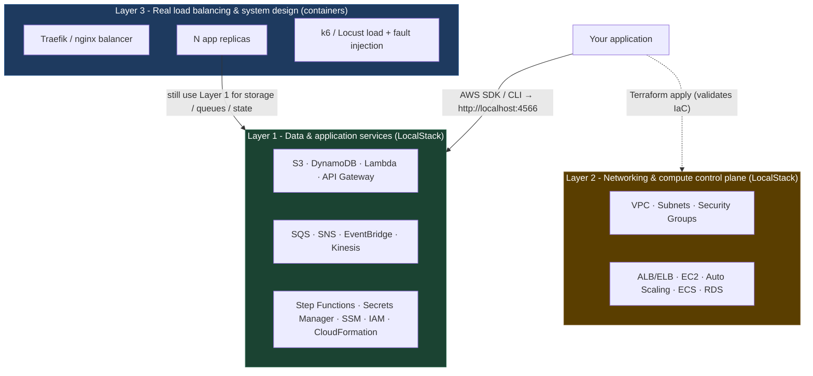
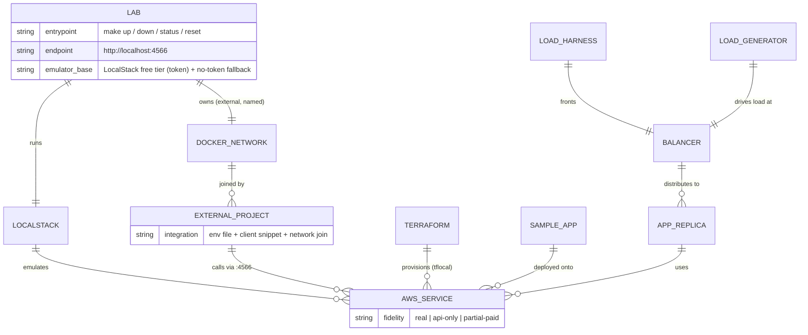

# aws-local-lab

A local, offline, AWS-compatible environment you run on your own machine, so you can
build and regression-test applications without incurring AWS charges - only electricity.

This document is the **project requirements**: what is being built, why, how it is
structured, and the decisions and constraints that govern it. Implementation lands
through the work tracks in section 7.

---

## 1. Goal and scope

### 1.1 Problem

Trying out AWS services and iterating on cloud applications costs money and risks
breaking shared/real infrastructure. There is no safe, free place to develop against
"AWS" and run regression tests.

### 1.2 Goal

One command brings up an AWS-compatible environment locally. Applications point their
AWS SDK/CLI at it instead of the real cloud. The environment can be wiped and rebuilt
freely, and other projects can attach to it for integration and regression testing.

### 1.3 In scope

- A reproducible local AWS emulator (LocalStack) with a documented start/stop/reset workflow.
- Infrastructure-as-code (Terraform) targeting the local emulator, including a
  representative "system design" stack (load balancer, target group, container service).
- An end-to-end sample application proving the high-fidelity services work.
- A kit for attaching arbitrary external projects to the lab.
- A real load-balancing / load-generation / fault-injection harness for studying
  system-design behavior that the emulator itself cannot provide.

### 1.4 Out of scope (for now)

- Real Kubernetes (k3d/kind). Container scaling via Docker Compose is sufficient for
  the current phase. Revisit if autoscaling experiments need it.
- Emulating AWS services that require the LocalStack paid tier, unless a specific need
  is identified and the tier is acquired.
- Production deployment to real AWS. The Terraform is written to stay portable to real
  AWS, but deploying it there is a separate concern.

---

## 2. The three-layer model (read this first)

A local AWS emulator is not one uniform thing. Fidelity varies by service, and the
architecture is built around three layers:



| Layer | What it is | Fidelity |
|---|---|---|
| **Layer 1** | Data and application services | **Real** - your code exercises these exactly as in production |
| **Layer 2** | Networking and compute | **API only** - Terraform applies and resources are describable, but no real traffic or VMs |
| **Layer 3** | Real balancer + replicas + load generator | **Actually runs** - real HTTP, real failover, real saturation behavior |

"Simulate load balancing and system design" lives in **Layer 3**. No AWS emulator
provides a real load-balancer dataplane or real compute; that is built from real
containers, while the app replicas still use Layer 1 for storage, queues, and state.

---

## 3. Component / relationship overview



---

## 4. Functional requirements

### FR-1 Core stack (`lab-core`)

- **FR-1.1** `docker-compose.yml` starts LocalStack on edge port `4566` with a pinned
  image tag (never `latest`).
- **FR-1.2** Two supported modes:
  - **Token mode (default):** reads `LOCALSTACK_AUTH_TOKEN` from `.env`, uses the current
    LocalStack image.
  - **No-token mode:** a documented override running a pinned pre-2026 community image
    with no token. Must produce a working `make up` + `make status` on its own.
- **FR-1.3** LocalStack is attached to an **external, named Docker network**
  (`aws-local-lab`) that other Compose projects can join.
- **FR-1.4** Named volume for `/var/lib/localstack`; optional `PERSISTENCE=1` so state
  survives restarts; optional `SERVICES` env to narrow eager loading.
- **FR-1.5** `Makefile` targets: `up`, `down`, `restart`, `logs`, `ps`, `status`,
  `reset` (stop + wipe volume + prune network), `shell`, and an `awslocal` passthrough.
- **FR-1.6** `bin/awslocal` wrapper: `aws --endpoint-url=http://localhost:4566` with
  dummy credentials and region defaulted.
- **FR-1.7** `bin/health-check.sh` queries `/_localstack/health`, prints a readable
  `service → state` table, exits non-zero if the edge is unreachable. Run by `make status`.
- **FR-1.8** `README`/`docs` record the pinned image tags and the health-endpoint contract.

### FR-2 Terraform stacks (`lab-terraform`)

- **FR-2.1** `tflocal` wiring (or an equivalent provider `endpoints{}` block) so `.tf`
  files stay identical to what real AWS would accept.
- **FR-2.2** A **foundation stack**: VPC, subnets, security groups.
- **FR-2.3** A **system-design stack**: Application Load Balancer + target group +
  container service (ECS) + Auto Scaling, with explicit notes on what is real vs API-only.
- **FR-2.4** A known-good AWS provider version constraint and a documented list of the
  sharp edges (S3 path-style addressing, hard-coded ARNs / account `000000000000`,
  IAM not enforced by default, Lambda packaging).
- **FR-2.5** `apply` / `destroy` wrapped in Make targets or scripts.

### FR-3 End-to-end sample app (`lab-sampleapp`)

- **FR-3.1** A multi-tier demo: HTTP API (API Gateway) → function (Lambda) → database
  (DynamoDB), plus a queue worker (SQS) and object storage (S3).
- **FR-3.2** Deployed to the lab via Terraform and/or a deploy script.
- **FR-3.3** An automated end-to-end test that exercises the full path and asserts results.
- **FR-3.4** Serves as a copyable template for real applications.

### FR-4 Integration kit (`lab-integration`)

- **FR-4.1** A documented pattern for attaching any external project: the endpoint URL,
  dummy credentials, region, and how to join the `aws-local-lab` network.
- **FR-4.2** A helper that generates the endpoint configuration as a single env file.
- **FR-4.3** Client-config snippets for **Python** (boto3) and **Node** (AWS SDK v3),
  written generically - there is no first integration target project yet; the captain
  will bring multiple over time.
- **FR-4.4** A short "regression baseline" workflow: snapshot lab state, run tests,
  restore to baseline.

### FR-5 Load / system-design harness (`lab-integration`)

- **FR-5.1** A real balancer (Traefik or nginx) in front of multiple replicas of a
  sample service, on the lab network.
- **FR-5.2** A load generator (k6 or Locust) with runnable scenarios.
- **FR-5.3** Fault injection (e.g. toxiproxy / pumba) to study failover and degradation.
- **FR-5.4** The replicas use Layer 1 services for their state, demonstrating the split.
- **FR-5.5** Documented: what this shows that the emulator cannot.

### FR-6 Research deliverable (`lab-research`)

- **FR-6.1** A service-by-service fidelity matrix for LocalStack (2026 free tier),
  the pre-2026 community image, and Moto.
- **FR-6.2** LocalStack 2026 licensing and auth-token facts, in plain language.
- **FR-6.3** A concrete, buildable recommendation for the Layer 3 harness.
- **FR-6.4** A state-persistence approach for regression baselines.
- **FR-6.5** Confirmation or correction of the scope of FR-1 through FR-5.

---

## 5. Non-functional requirements

- **NFR-1 Zero cloud cost.** Nothing in normal operation calls a paid API. The only
  running cost is local compute.
- **NFR-2 Reproducible.** A fresh clone with only Docker installed can reach
  `make status` by following the README, with no undocumented steps.
- **NFR-3 Disposable.** `make reset` returns the lab to a clean state. No manual cleanup.
- **NFR-4 Pinned.** Every external image and tool version is pinned explicitly.
- **NFR-5 Portable IaC.** Terraform stays valid against real AWS; only endpoints differ.
- **NFR-6 Clean seams.** Each work track occupies its own directory and its own
  README/Makefile sections so parallel branches merge without collision.
- **NFR-7 Scripts pass `shellcheck`.**
- **NFR-8 Honest fidelity.** Documentation states clearly, per service, what is real
  vs API-only, so tests are not written against illusions.

---

## 6. Service coverage expectations

| Capability | Local fidelity | Usable for build + regression testing? |
|---|---|---|
| Object storage, NoSQL, queues, pub/sub, events | Real | Yes - the sweet spot |
| Serverless functions + HTTP APIs | Real | Yes |
| Workflows, secrets, parameters, IAM shapes | Real | Yes |
| VPC / subnets / security groups | API only | For validating Terraform; no packet routing |
| Load balancers, EC2, Auto Scaling, ECS | API only | Terraform validates; real behavior via Layer 3 |
| Managed databases (RDS/Aurora), other advanced services | Partial / paid | `lab-research` confirms exactly which need the paid tier |

The authoritative, evidence-backed matrix is produced by `lab-research` (FR-6).

---

## 7. Work tracks

Delivered in two waves. Wave 2 depends on `lab-core` landing first, then runs in parallel.

| Track | Wave | Type | Delivers |
|---|---|---|---|
| `lab-research` | 1 | research | Coverage matrix + architecture recommendation (FR-6) |
| `lab-core` | 1 | build | Core stack: compose, network, Makefile, health check, README (FR-1) |
| `lab-terraform` | 2 | build | `tflocal` + foundation + system-design stacks (FR-2) |
| `lab-sampleapp` | 2 | build | End-to-end sample application (FR-3) |
| `lab-integration` | 2 | build | Integration kit (FR-4) + load/system-design harness (FR-5) |

---

## 8. Decisions and constraints

| # | Decision | Rationale |
|---|---|---|
| D-1 | Emulator base is **LocalStack free tier** | Best AWS coverage; free for non-commercial use. Needs a one-time free account + auth token. |
| D-2 | **No-token fallback** is always supported | Lets the lab and its tests run without the captain's personal token, e.g. in CI or on a fresh machine. |
| D-3 | Repository is **public** (`SimplyAvi/aws-local-lab`) | Captain's choice. Keep secrets and tokens out of the repo; `.env` is gitignored. |
| D-4 | Delivery is **direct-PR with auto-merge on green** | Each track pushes a branch and opens a PR; it merges once checks pass. Fast, with visible history and a green gate, without a heavy review pipeline. |
| D-5 | **Compose container-scaling**, not Kubernetes | Sufficient for current system-design experiments. k3d revisited only if needed. |
| D-6 | Integration kit is **generic** (Python + Node) | No first target project exists yet; the captain will bring several. |
| D-7 | Terraform via **tflocal**, `.tf` stays AWS-portable | Develop locally, keep the option to point at real AWS later. |

---

## 9. Risks and open items

| Risk / item | Status |
|---|---|
| LocalStack free tier is **non-commercial only** | Accepted for now. If apps become commercial, the tier must be revisited. |
| Load balancers / EC2 / ECS are **API-only** in the emulator | Mitigated by the Layer 3 harness (FR-5). |
| Some services may require the **paid tier** | `lab-research` (FR-6.5) confirms before Wave 2 commits. |
| **LocalStack auth token** not yet provided | OPEN - captain creates a free account at app.localstack.cloud and supplies the token. Work proceeds on the no-token image meanwhile. |
| Parallel worker runtime is the **experimental backend** (standard one not installed) | Accepted. Monitored during Wave 1. |

---

## 10. Getting started

Delivered by `lab-core` (FR-1). Deeper reference: [`docs/foundation.md`](docs/foundation.md).

### 10.1 Prerequisites

- **Docker** with Compose v2 (`docker compose ...`). Nothing else is required for
  the no-token path.
- Optional: **`jq`** for a formatted `make status` table (raw JSON without it).
- Optional: a **free LocalStack auth token** from
  [app.localstack.cloud](https://app.localstack.cloud) -> Auth Tokens, for token mode.

### 10.2 No-token path (works with zero setup)

```sh
cp .env.example .env         # defaults are fine as-is
make up NO_TOKEN=1           # creates the aws-local-lab network + boots the pinned
                             #   pre-2026 community image (localstack/localstack:3.8.1)
make status                  # service -> state table
bin/awslocal s3 mb s3://smoke && bin/awslocal s3 ls
make reset NO_TOKEN=1        # stop + wipe volume + prune network
```

### 10.3 Token path (default)

```sh
cp .env.example .env
# edit .env: set LOCALSTACK_AUTH_TOKEN=<your free-tier token>
make up                      # boots the current image (localstack/localstack:4.9.0)
make status
```

`make up` alone uses token mode; `LOCALSTACK_AUTH_TOKEN` is read from `.env`. If
that variable is set in your shell environment, token mode picks it up too - the
only difference from the no-token path is the image tag and that Pro-tier
services become reachable.

### 10.4 Everyday targets

| Target | Does |
|---|---|
| `make up` / `make up NO_TOKEN=1` | Create the external network, start LocalStack, wait for the edge, print status. |
| `make down` | Stop containers, keep the volume. |
| `make restart` | `down` then `up`. |
| `make logs` / `make ps` | Follow logs / show compose status. |
| `make status` | Run `bin/health-check.sh` against `/_localstack/health`. |
| `make reset` | Stop, remove the `aws-local-lab-data` volume, prune the network. |
| `make shell` | Shell into the container. |
| `make awslocal ARGS="s3 ls"` | AWS CLI against the lab. |

Knobs live in `.env` (`PERSISTENCE=1`, `SERVICES=s3,dynamodb,...`, `EDGE_PORT`,
`LOCALSTACK_IMAGE`, ...) - each documented inline in `.env.example`.

### 10.5 Point another project at the lab

Full integration kit comes in `lab-integration` (FR-4). The short version:

```yaml
# other project's docker-compose.yml
networks:
  aws-local-lab:
    external: true
services:
  app:
    networks: [aws-local-lab]
    environment:
      AWS_ENDPOINT_URL: http://aws-local-lab:4566   # container-to-container
      AWS_ACCESS_KEY_ID: test
      AWS_SECRET_ACCESS_KEY: test
      AWS_DEFAULT_REGION: us-east-1
```

From the host, use `http://localhost:4566` (or `bin/awslocal`).

### 10.6 Troubleshooting

| Symptom | Fix |
|---|---|
| `LOCALSTACK_AUTH_TOKEN` / activation errors on `make up` | Use `make up NO_TOKEN=1`, or put a valid free-tier token in `.env`. The no-token path never contacts LocalStack's API. |
| `Bind for 0.0.0.0:4566 failed: port is already allocated` | Another process/container holds 4566. Stop it, or set `EDGE_PORT=4599` in `.env` (and export `LAB_ENDPOINT=http://localhost:4599` for `bin/awslocal`). |
| `permission denied` on `/var/run/docker.sock` | Your user must be able to reach the Docker socket (Docker Desktop: ensure it's running; Linux: add yourself to the `docker` group and re-login). |
| First `make up` is slow | Initial image pull is ~300 MB. Later boots take a few seconds. Narrow `SERVICES` in `.env` to speed eager loading. |
| `make status` prints raw JSON | Install `jq` for the formatted table. |
| State lost after `make restart` | Set `PERSISTENCE=1` in `.env`. `make reset` always wipes regardless. |

## 11. Sample application (FR-3, `lab-sampleapp`)

`examples/serverless-crud/` is a copyable end-to-end serverless app deployed to the
lab: API Gateway (REST) -> Lambda -> DynamoDB for a "notes" resource, plus an S3
presigned-upload flow and an SQS + worker-Lambda event path.

| Target | Does |
|---|---|
| `make sample-deploy` | Create every resource via `bin/awslocal`; writes `examples/serverless-crud/.stack.env`. |
| `make sample-test` | End-to-end regression check (stdlib Python, asserts behaviour; non-zero exit on failure). |
| `make sample-destroy` | Tear it all down. |

```bash
make up NO_TOKEN=1 && make sample-deploy && make sample-test
```

Pass `EDGE_PORT=<port>` to all three if 4566 is taken. Details, the architecture
diagram, and the LocalStack quirks it works around are in
[`examples/serverless-crud/README.md`](examples/serverless-crud/README.md).

---

## 12. Integration kit and load harness (`lab-integration`, FR-4 / FR-5)

Full guide: [`integration/README.md`](integration/README.md) and
[`integration/load-harness/README.md`](integration/load-harness/README.md).

- **Attach any project** to the lab: join the external `aws-local-lab` network,
  point the AWS SDK at `http://aws-local-lab:4566` (in-network) or
  `http://localhost:4566` (host). `integration/aws-local-env.sh` emits a
  ready-to-source env file or a `docker-compose.override.yml` snippet in one
  command, auto-detecting host vs in-network.
- **Client snippets** (generic, containerised): `integration/examples/python/`
  (boto3) and `integration/examples/node/` (AWS SDK v3), each with a Dockerfile
  and an S3 + DynamoDB smoke test.
- **`make integrate-smoke`** - runs both example smoke containers against the lab
  from inside the network, asserts success.
- **Regression baseline** - the no-token community image does not durably
  persist data-plane state, so the baseline is `make lab-seed` (idempotent) and
  "restore" is `make reset && make up && make lab-seed`. `make lab-snapshot` /
  `make lab-restore` (volume tar) are provided for LocalStack Pro. See
  `integration/README.md` §4.
- **Layer 3 load harness** - `make load-up` / `load-run` / `load-fault` /
  `load-down`: Traefik balancing real HTTP across N stateless app replicas
  (state in LocalStack S3 + DynamoDB), k6 load scenarios, pumba fault injection.

Extra knobs (this track): `LOAD_REPLICAS`, `LOAD_VUS`, `LOAD_HOLD`,
`LOAD_LB_PORT`, `FAULT_INTERVAL`, `FAULT_DURATION`, `SNAPSHOT_NAME`.

---

## 13. Terraform stacks (`lab-terraform`)

Terraform IaC targeting the lab lives in [`terraform/`](terraform/) - see
[`terraform/README.md`](terraform/README.md) for the full guide.

- **`terraform/foundation/`** - VPC, 2 subnets across AZs, internet gateway +
  route table, security groups. Applies and destroys cleanly on the no-token
  image.
- **`terraform/system-design/`** - ALB + target group + listener, ECS cluster +
  Fargate service + task definition, Application Auto Scaling. Depends on
  `foundation` via `terraform_remote_state`. `validate` + `plan` clean on the
  no-token image; **`apply` needs LocalStack Pro or real AWS** (`elbv2` / `ecs` /
  `application-autoscaling` are Pro-only). The real load-balancing test is
  `lab-integration`'s Layer 3 harness.

Local wiring is a committed `providers.tf` per stack (an `endpoints {}` block at
`http://127.0.0.1:4566` with dummy creds); every other `.tf` is valid against
real AWS. Terraform is pinned to `1.5.7`, `hashicorp/aws` to `5.83.1`.

```sh
make up NO_TOKEN=1
make tf-install                 # pinned terraform -> terraform/.bin/
make tf-foundation-apply
make tf-plan-all                # system-design plans clean; apply needs Pro
make tf-destroy-all
```

Targets: `tf-install`, `tf-validate`, `tf-fmt-check`, `tf-foundation-apply` /
`tf-foundation-destroy`, `tf-system-design-apply` / `tf-system-design-destroy`,
`tf-plan-all`, `tf-destroy-all`.
